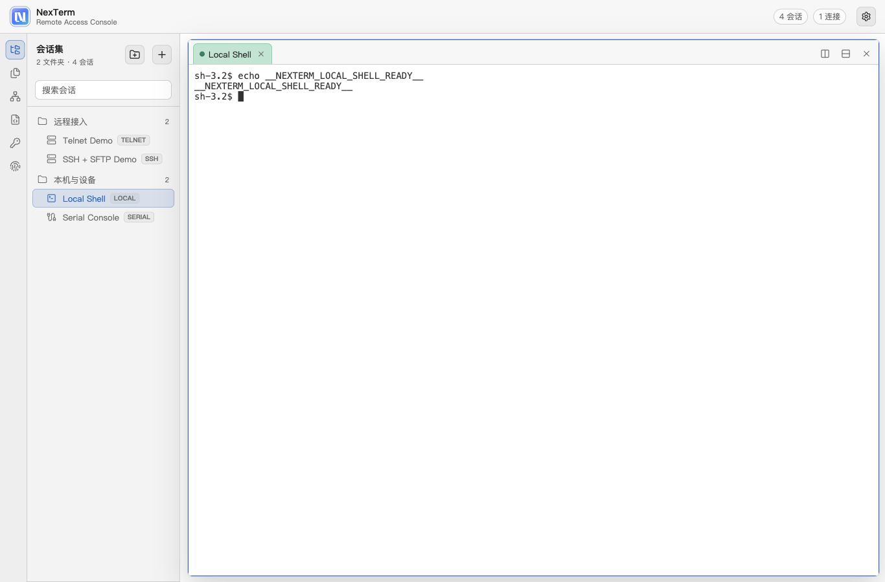
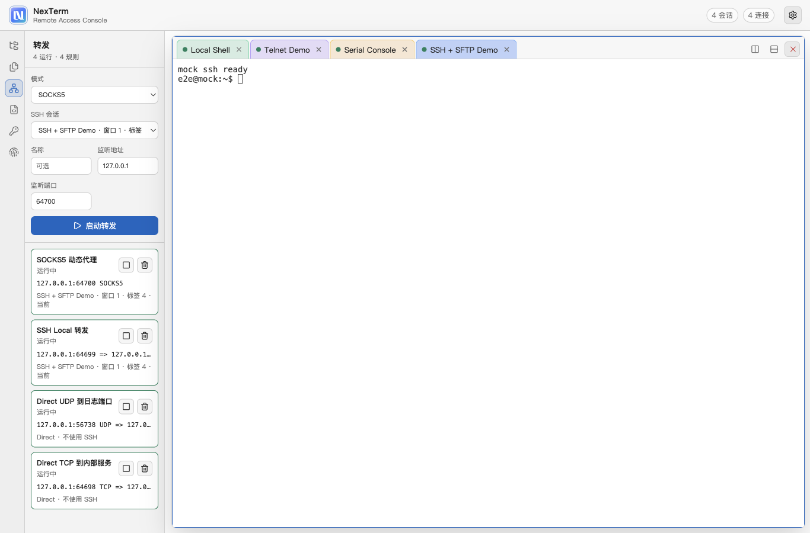
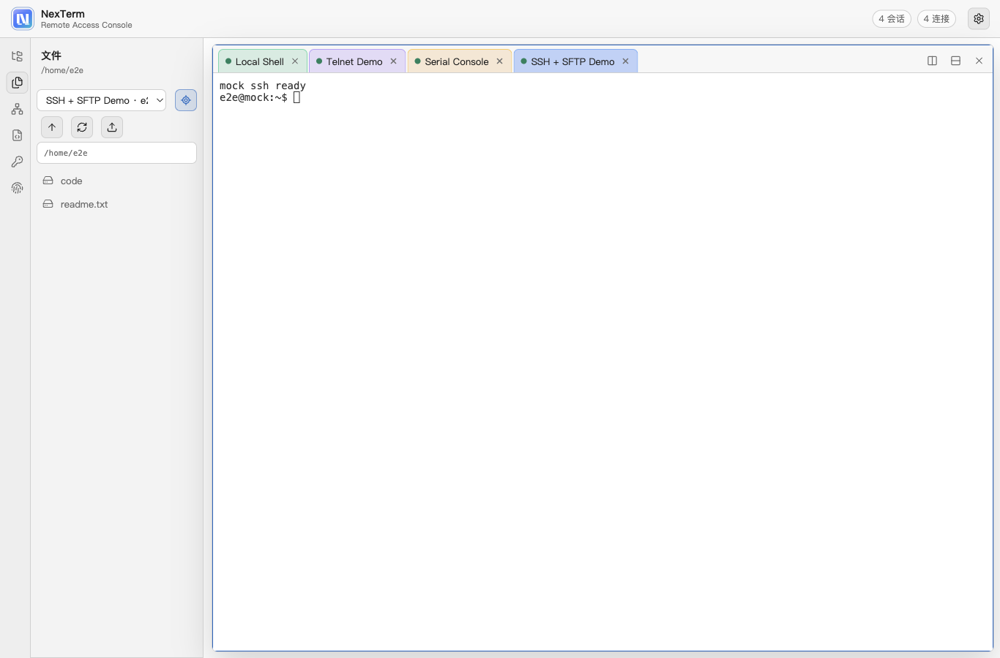
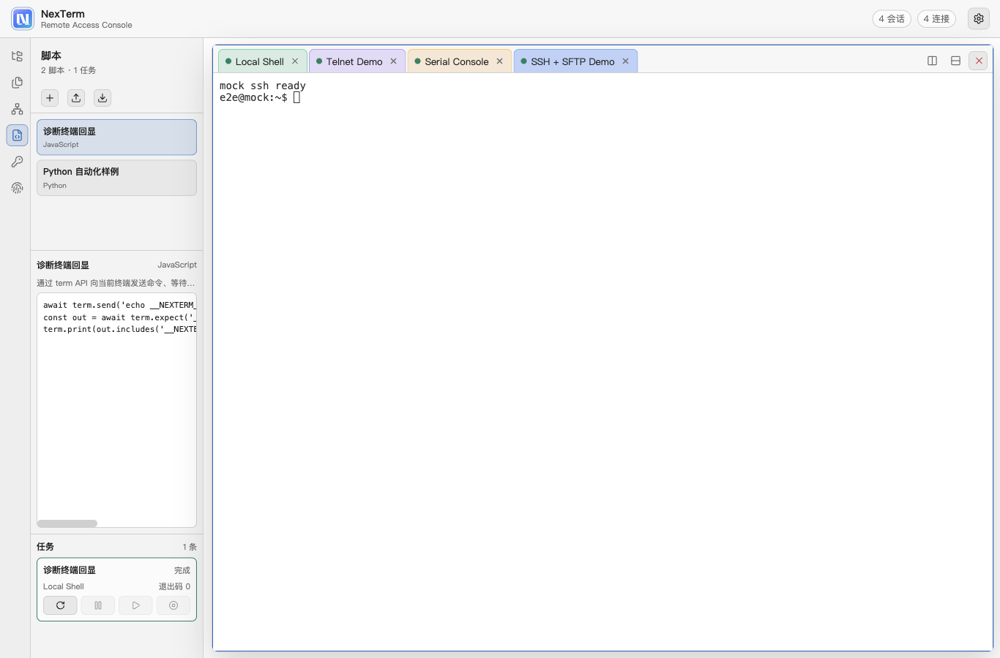
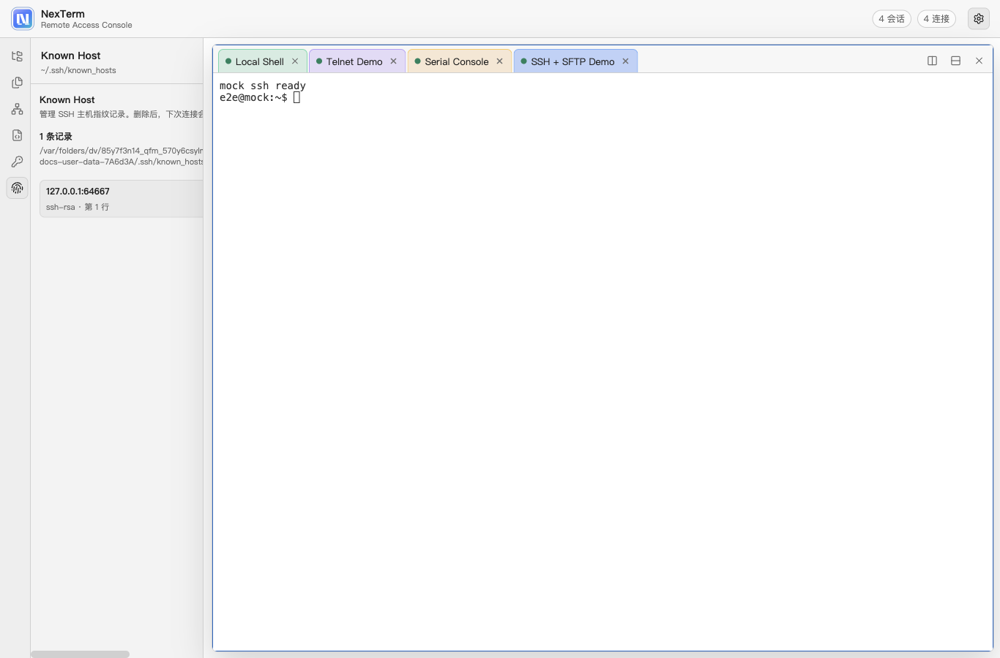

# NexTerm

跨平台远程接入终端，采用 Electron 主进程 / preload / Vue 3 渲染进程架构，按模块拆分 `App` + IPC、`EventDispatcher` 统一事件、`{status,msg,data}` 返回格式。

当前支持 SSH / SFTP、TCP / UDP / SSH 端口转发、Telnet、Serial、本地 Shell、主题切换、会话管理与终端日志。样式/主题/组件外观全部自研封装，终端渲染使用 `xterm.js`。

## 功能

- **Telnet 终端**：自实现 IAC 选项协商（ECHO / SGA / NAWS / TERMINAL-TYPE），多标签会话。
- **Serial 串口**：通过 `serialport` 接入 macOS / Windows 串口设备，支持端口枚举、波特率、数据位、停止位、校验、流控、DTR / RTS。
- **本地 Shell**：通过 `node-pty` 接入系统伪终端，macOS / Linux 使用系统 pty，Windows 使用 `node-pty` 的 ConPTY / winpty 后端选择。
- **SSH / SFTP**：通过 `ssh2` 接入远程终端和文件面板，支持 known_hosts 校验。
- **端口转发**：支持不依赖 SSH 的 Direct TCP / UDP 转发，也支持 SSH Local、SSH Remote 和 SOCKS5 Dynamic 隧道。
- **会话管理**：左侧树形会话管理器，支持多级文件夹、新建 / 编辑 / 删除、拖动归档、双击连接；会话和文件夹持久化在应用 `userData/data/sessions.json`。
- **主题切换**：内置 深色 / 浅色 / Solarized / Monokai，单一主题对象同时驱动应用外壳 CSS 令牌与 xterm 配色；可调字号；实时热更新。
- **离线激活**：未激活可试用 30 天，支持导出激活请求并导入签名授权文件；签发流程见 [docs/LICENSE_ACTIVATION.md](docs/LICENSE_ACTIVATION.md)。

## 界面截图

完整功能截图由 `npm run screenshots` 自动生成，覆盖会话管理、各协议终端、SFTP、端口转发、脚本、Keychain、Known Host 和设置面板。完整清单见 [docs/SCREENSHOTS.md](docs/SCREENSHOTS.md)。

| 工作区 | 端口转发 |
| --- | --- |
|  |  |

| SFTP | 脚本 |
| --- | --- |
|  |  |

| Keychain | Known Host |
| --- | --- |
|  |  |

## 开发运行

```bash
npm install
npm run dev      # 同时启动 Vite(5273) 与 Electron
npm run start    # 仅启动本地浏览器预览：http://127.0.0.1:5273
npm run screenshots # 构建并自动生成 docs/screenshots/ 功能截图
```

`npm install` 会自动重编 `node-pty` 和 `@serialport/bindings-cpp` 到当前 Electron ABI，Windows / macOS / Linux 都走同一套安装流程。

Electron 固定在 `22.3.27`：这是保留 Windows 7 / 8 / 8.1 兼容的最后一个 Electron 主线。Electron 23+ 已移除这些系统支持，不要直接升级到 23 或更高版本。

## 构建

```bash
npm run build    # 构建前端到 dist/
npm run lint     # ESLint 检查
npm run test:e2e # 构建后运行 Playwright Electron E2E
```

## 目录结构

```
electron/
  main.js                 # 创建窗口、加载页面
  preload.js              # contextBridge 暴露 sessionApi / terminalApi / settingsApi
  app/
    systemApp.js          # 中央协调器（共享 store + 事件分发器）
    sessionApp.js         # 会话定义 CRUD
    telnetApp.js          # 终端连接编排（Telnet / SSH / Serial / Local）
    settingsApp.js        # 主题 / 字号
  utils/
    telnetManager.js      # 自实现 Telnet 协议（IAC 状态机）
    serialManager.js      # Serial 串口连接管理
    eventDispatcher.js    # 主->渲染 统一事件 (unified-event)
    responseUtils.js
  const/telnetConst.js
src/
  theme/                  # 主题体系（自研样式核心）
    themes.js             # 主题对象：app 令牌 + xterm 配色
    themeManager.js       # 注入 CSS 变量 / 产出 xterm ITheme
  styles/tokens.css       # 设计令牌默认值
  components/
    AppShell.vue  SessionSidebar.vue  TabBar.vue
    TerminalPane.vue      # xterm 封装：输入/输出/resize/状态
    SessionDialog.vue  ThemeMenu.vue
  store.js                # 全局响应式状态
  utils/eventBus.js       # 接入 unified-event 并按 type 分发
```

## 验证连接

可用公开 Telnet 服务测试，例如电影《星球大战》ASCII 动画：

```
towel.blinkenlights.nl : 23
```

> 后续规划：凭据加密(safeStorage)、更多导入格式。
