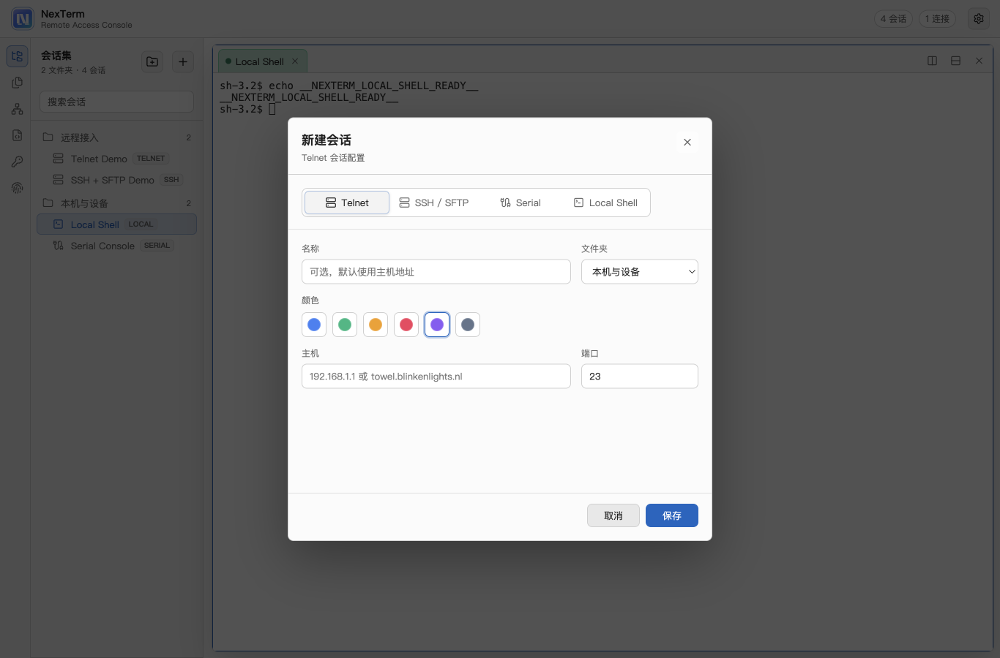
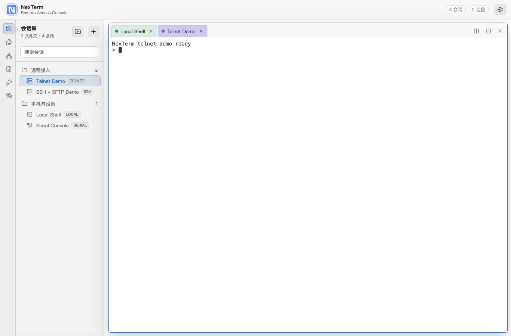
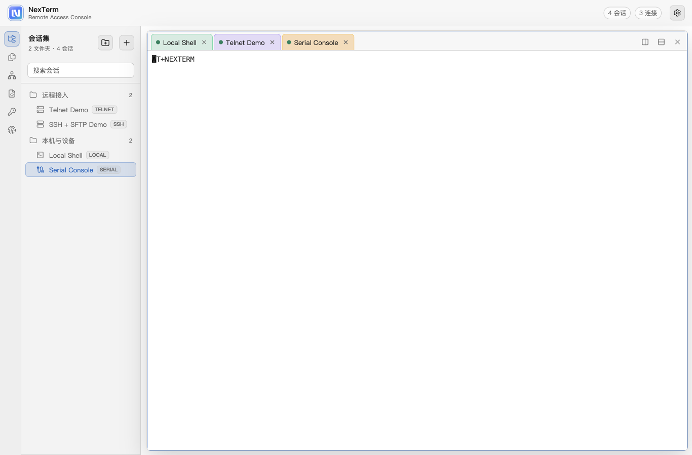
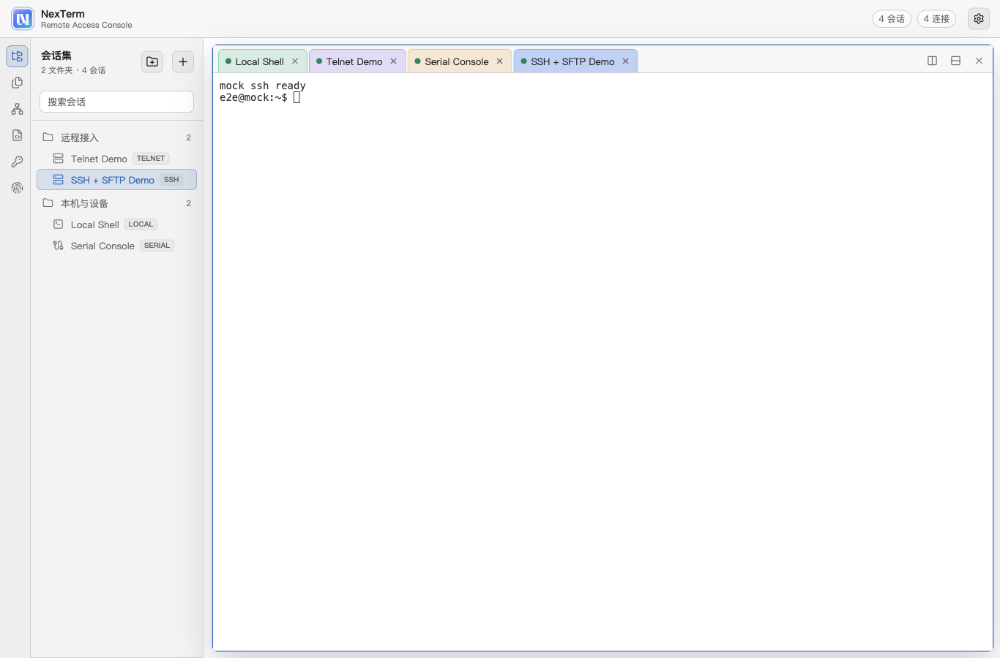
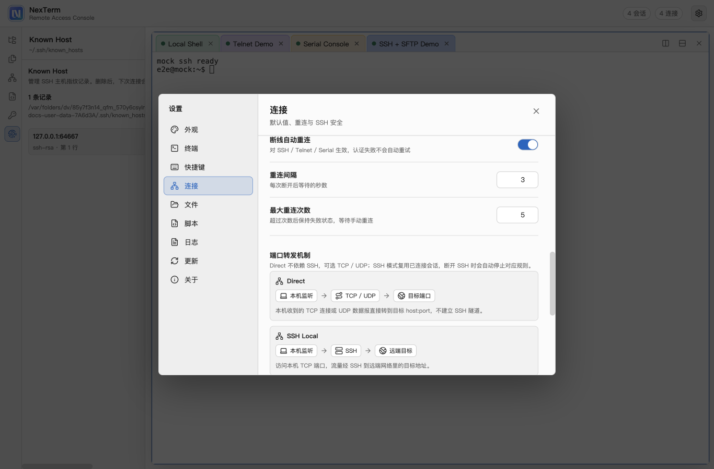
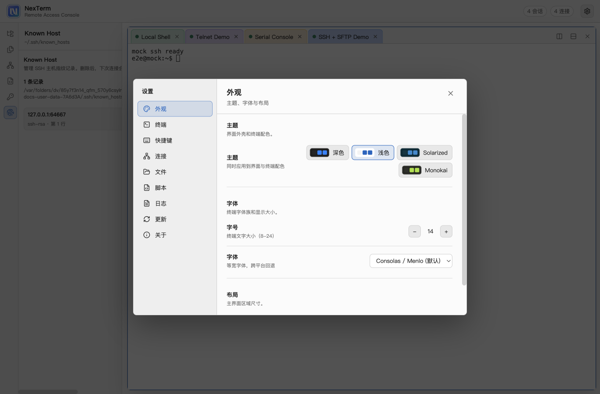

# 功能截图

本目录下的截图由自动化脚本生成，用于 README、发布说明和功能验收。脚本会启动 Electron 测试环境，使用临时 `userData`，并准备浅色主题、mock SSH/SFTP、mock Serial、本地 Telnet、Local Shell、脚本任务、Keychain、Known Host 和端口转发规则。

## 重新生成

```bash
npm run screenshots
```

输出目录固定为 `docs/screenshots/`。每次执行会清空旧截图并重新生成最新界面。

## 覆盖范围

| 功能 | 截图 |
| --- | --- |
| 会话树、本地 Shell、终端标签 |  |
| 新建会话、协议切换、会话颜色 |  |
| Telnet 终端 |  |
| Serial 串口终端 |  |
| SSH 终端 |  |
| SFTP 文件面板 |  |
| Direct TCP / UDP、SSH Local、SOCKS5 端口转发 |  |
| 脚本库、term API、任务状态 |  |
| Keychain、OpenSSH 私钥列表 |  |
| Known Host、SSH 主机指纹记录 |  |
| 连接设置、自动重连、端口转发机制说明 |  |
| 外观设置、主题、字体和侧栏宽度 |  |

## 自动化说明

- 脚本入口：[scripts/capture-screenshots.cjs](../scripts/capture-screenshots.cjs)
- Electron 使用 `NODE_ENV=test` 加载 `dist/index.html`，因此 `npm run screenshots` 会先执行 `npm run build`。
- 脚本会预置浅色主题，保证文档截图风格统一。
- Serial 使用 `NEXTERM_SERIAL_MOCK=1`，不会访问真实串口设备。
- SSH / SFTP 使用内置测试服务器，不需要外部网络。
- Keychain 使用临时 `~/.ssh/id_ed25519`，Known Host 使用连接 mock SSH 后生成的临时 `known_hosts`。
- 端口转发截图会启动真实本地监听规则，但只绑定临时端口，脚本结束后会关闭应用和测试服务。
